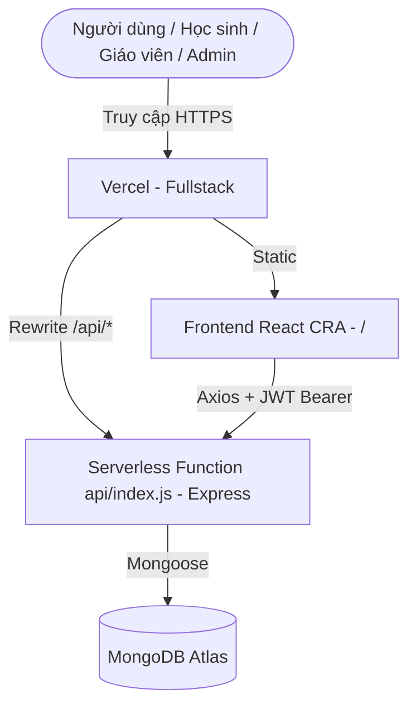

# EKLASSES - NỀN TẢNG QUẢN LÝ LỚP HỌC TRỰC TUYẾN (TUTORING PLATFORM)

Chào mừng bạn đến với **EKLASSES** - nền tảng quản lý lớp học trực tuyến cho giáo viên tự do và gia sư, tích hợp đầy đủ **lớp học, video bài giảng, tài liệu, bài kiểm tra trắc nghiệm, bài tập và thông báo** trong một hệ thống duy nhất với 3 phân quyền **Admin / Giáo viên / Học sinh**.

---

## 0. LIÊN KẾT WEBSITE (WEBSITE LINKS)

| Môi trường | Địa chỉ | Ghi chú |
|------------|---------|---------|
| Production (Vercel) | `https://<domain-cua-ban>.vercel.app` | Frontend + API fullstack chung 1 domain (thay `<domain-cua-ban>` bằng domain thật sau khi deploy) |
| Health check (production) | `https://<domain-cua-ban>.vercel.app/api/health` | Phải trả về `{"status":"ok"}` thì backend mới sống |
| API docs (production) | `https://<domain-cua-ban>.vercel.app/api/docs` | Danh sách endpoint rút gọn |
| Local frontend | `http://localhost:3000` | Chạy bằng `npm start --prefix frontend` |
| Local backend | `http://localhost:5000` | Chạy bằng `npm run dev --prefix backend` |
| Health check (local) | `http://localhost:5000/api/health` | Phải trả về `{"status":"ok"}` |

---

## 0.1. TÀI KHOẢN ADMIN MẶC ĐỊNH (DEFAULT ADMIN ACCOUNT)

Tài khoản quản trị gốc **ghi cố định trong backend** (`backend/config/defaultAdmin.js`), là tài khoản mặc định của website:

| Trường | Giá trị |
|--------|---------|
| Email đăng nhập | `admin@eklasses.vn` |
| Mật khẩu | `Admin123!` |
| Tên hiển thị | `Quản trị viên` |
| Quyền | `admin` (cao nhất) |

Quy tắc bảo vệ Super Admin gốc:
* Luôn đăng nhập được, không phụ thuộc biến môi trường hay seed thủ công — backend tự tạo/khôi phục record trong MongoDB mỗi khi kết nối DB (`ensureSuperAdmin()` trong `backend/utils/superAdmin.js`, gọi từ `connectDB()` và `seed-admin.js`).
* **Không thể bị xóa** (`DELETE /api/users/:id` trả `403` cho email gốc).
* **Không thể bị thay đổi quyền** (`PUT /api/users/:id/role` trả `403`, hook `pre-save` của model `User` luôn ép `role` về `admin`).
* **Không thể đăng ký chiếm** (`POST /api/auth/register` trả `400` cho email gốc).
* **Có quyền cấp/thu hồi admin** cho tài khoản khác qua `PUT /api/users/:id/role` (body `{ role: 'admin' | 'teacher' | 'student' }`) và xem toàn bộ user qua `GET /api/users` — cả hai đều yêu cầu JWT `adminOnly`.

Đăng nhập trang `/login` bằng đúng email + mật khẩu trên là vào quyền admin ngay.

---

## 1. KIẾN TRÚC HỆ THỐNG (SYSTEM ARCHITECTURE)

Hệ thống chạy theo mô hình **Client-Server**, deploy fullstack trên cùng một domain Vercel (frontend + serverless API), dữ liệu lưu trên MongoDB Atlas.



### 1.1. Công nghệ Frontend (Create React App)
* **Framework chính:** React 18 + React Router v6 (SPA, phân route `/login`, `/register`, `/dashboard`, `/class/:id`, `/quiz/:quizId/take`).
* **Gọi API:** Axios tập trung tại `src/config/api.js` — tự đọc `REACT_APP_API_URL`, tự gắn `Authorization: Bearer <token>` cho mọi request.
* **Bài giảng video:** `react-player` phát video theo URL.
* **Thống kê:** `recharts` vẽ biểu đồ (điểm số, tiến độ học tập).
* **Styling:** 1 file CSS duy nhất `src/styles/App.css` + style inline theo component; giao diện tiếng Việt, thương hiệu EKLASSES.

### 1.2. Công nghệ Backend & Database
* **Runtime Environment:** Node.js v18+ kết hợp Express framework (`backend/server.js`, export `app` để vừa chạy local `node server.js` vừa chạy serverless trên Vercel qua `api/index.js`).
* **Cơ sở dữ liệu:** MongoDB (Mongoose v7), lưu trên MongoDB Atlas khi deploy, Mongo local khi dev.
* **Kết nối serverless:** Cache connection `global.mongoose` + middleware đảm bảo `connectDB()` trước mọi request `/api/*` (chống cold-start fail).
* **Bảo mật & Mã hóa:** Xác thực JWT (Bearer token, hết hạn 7 ngày) qua `authMiddleware`; phân quyền `teacherOnly` (giáo viên + admin) và `adminOnly`; mật khẩu hash bằng bcryptjs (pre-save hook + `comparePassword`).
* **Tài liệu/Video:** Lưu theo URL (`fileUrl`, `videoUrl`) do client cung cấp, backend chỉ lưu metadata (không upload file trực tiếp).

---

## 2. CÁC TÍNH NĂNG CHÍNH (KEY FEATURES)

### 2.1. Xác thực & Phân quyền (`/login`, `/register`)
* Đăng ký 2 vai trò public: **Học sinh / Giáo viên** (đăng ký `admin` và email admin gốc bị chặn ở backend).
* Đăng nhập trả về JWT + `{ id, name, email, role }`, lưu `token/userId/userRole` vào localStorage.
* Super Admin gốc `admin@eklasses.vn / Admin123!` (chi tiết ở mục 0.1): luôn đăng nhập được, tự tạo/khôi phục record, không thể xóa/hạ quyền, có quyền cấp admin cho tài khoản khác qua `PUT /api/users/:id/role`.
* Tương thích ngược env cũ: nếu đặt `ADMIN_EMAIL` + `ADMIN_PASSWORD` (tuỳ chọn `ADMIN_NAME`) khác tài khoản gốc thì cặp đó cũng đăng nhập được quyền admin.
* Tạo thủ công (tuỳ chọn): `npm run seed:admin --prefix backend` (đọc `ADMIN_EMAIL/ADMIN_PASSWORD/MONGODB_URI`, luôn đảm bảo Super Admin gốc tồn tại).

### 2.2. Dashboard (`/dashboard`)
* Giáo viên: xem lớp mình dạy + tạo lớp mới (tên, mô tả, môn, khối).
* Học sinh: xem các lớp đã tham gia.
* Admin: xem **tất cả** lớp + tạo lớp như giáo viên.

### 2.3. Chi tiết lớp học (`/class/:id`)
* 5 tab: Tổng quan, Video, Tài liệu, Kiểm tra, Bài tập + Thông báo.
* Giáo viên: thêm học sinh bằng email (`POST /api/classes/:id/enroll`), đăng thông báo theo độ ưu tiên (`low/normal/high`).
* Học sinh: xem nội dung, nộp bài.

### 2.4. Làm bài kiểm tra (`/quiz/:quizId/take`) — chống gian lận
* Đếm ngược `timeLimit` (phút), hết giờ tự nộp.
* Phát hiện chuyển tab (`visibilitychange`) và cảnh báo.
* Hỗ trợ 3 dạng câu hỏi: trắc nghiệm (`multiple-choice`), tự luận (`essay`), trả lời ngắn (`short-answer`); chấm điểm + lưu lịch sử nộp bài.

### 2.5. Quản lý nội dung (Giáo viên)
* **Video:** thêm video theo URL + thumbnail, đếm lượt xem theo học sinh (`POST /api/videos/:id/view`).
* **Tài liệu:** thêm tài liệu theo URL + loại/dung lượng file, đếm lượt tải (`POST /api/documents/:id/download`).
* **Bài tập:** giao bài có hạn nộp + tổng điểm, học sinh nộp file URL, giáo viên chấm điểm + feedback.
* **Thông báo:** đăng thông báo theo lớp, theo dõi ai đã đọc (`readBy`).

---

## 3. SƠ ĐỒ CƠ SỞ DỮ LIỆU (DATABASE SCHEMA)

MongoDB gồm 8 collections chính:

### Collection `users` (Học sinh, Giáo viên, Admin)
* `_id` (ObjectId, Khóa chính)
* `name` (String, bắt buộc)
* `email` (String, bắt buộc, unique)
* `password` (String, bắt buộc, hash bcrypt)
* `role` (String, enum `student`/`teacher`/`admin`, bắt buộc)
* `avatar` (String, mặc định null) / `bio` (String) / `phone` (String)
* `enrolledClasses` ([ObjectId ref `Class`])
* `createdAt` / `updatedAt` (Date)

### Collection `classes` (Lớp học)
* `_id` / `name` (String, bắt buộc) / `description` (String)
* `teacher` (ObjectId ref `User`, bắt buộc)
* `students` ([ObjectId ref `User`])
* `subject` (String, bắt buộc) / `grade` (String) / `capacity` (Number, mặc định 50)
* `schedule` ({ `dayOfWeek`, `startTime`, `endTime` }) / `thumbnail` (String)
* `status` (enum `active`/`inactive`, mặc định `active`)

### Collection `quizzes` (Bài kiểm tra, nhúng `questions`)
* `_id` / `title` (bắt buộc) / `description`
* `class` (ref `Class`, bắt buộc) / `teacher` (ref `User`, bắt buộc)
* `questions[]`: { `type` (enum `multiple-choice`/`essay`/`short-answer`), `question`, `options[]`, `correctAnswer`, `points` }
* `totalPoints` / `timeLimit` (phút) / `dueDate` / `allowReview` / `shuffleQuestions`
* `status` (enum `draft`/`published`/`closed`)

### Collection `quizsubmissions` (Bài nộp)
* `quiz` (ref `Quiz`) / `student` (ref `User`) / `class` (ref `Class`)
* `answers[]` / `score` / `submittedAt`

### Collection `assignments` (Bài tập, nhúng `submissions`)
* `_id` / `title` (bắt buộc) / `description`
* `class` (ref `Class`) / `teacher` (ref `User`)
* `dueDate` (bắt buộc) / `totalPoints` (mặc định 100)
* `submissions[]`: { `student`, `fileUrl`, `submittedAt`, `isLate`, `score`, `feedback`, `gradedAt` }

### Collection `videos` (Video bài giảng)
* `_id` / `title` / `description` / `class` (ref) / `teacher` (ref)
* `videoUrl` / `duration` / `thumbnail` / `views`
* `viewedBy[]`: { `student`, `viewedAt`, `duration` }

### Collection `documents` (Tài liệu)
* `_id` / `title` / `description` / `class` (ref) / `teacher` (ref)
* `fileUrl` / `fileType` / `fileSize` / `downloads`

### Collection `announcements` (Thông báo)
* `_id` / `title` (bắt buộc) / `content` (bắt buộc)
* `class` (ref) / `teacher` (ref)
* `priority` (enum `low`/`normal`/`high`, mặc định `normal`)
* `readBy[]`: { `student`, `readAt` }

---

## 4. HƯỚNG DẪN CÀI ĐẶT CỤC BỘ (LOCAL SETUP)

### Bước 1: Chuẩn bị
1. Clone dự án về máy, cài Node.js v18+.
2. Chạy MongoDB local (`mongodb://localhost:27017`) hoặc tạo cluster free trên MongoDB Atlas.
3. Tại thư mục `/backend`, tạo tệp `.env`:
   ```env
   MONGODB_URI=mongodb://localhost:27017/tutoring-platform
   JWT_SECRET=ma_bao_mat_jwt_cua_ban
   PORT=5000
   ```

### Bước 2: Cài dependencies và tạo admin
```bash
npm install --prefix backend
npm install --prefix frontend
# Tạo tài khoản admin (mặc định admin@eklasses.vn / Admin123!)
npm run seed:admin --prefix backend
# Hoặc chỉ định rõ:
# MONGODB_URI=<chuỗi-atlas> ADMIN_EMAIL=admin@eklasses.vn ADMIN_PASSWORD=MatKhauManh npm run seed:admin --prefix backend
```

### Bước 3: Chạy 2 terminal song song
```bash
# Terminal 1 - Backend (http://localhost:5000)
npm run dev --prefix backend
# Terminal 2 - Frontend (http://localhost:3000, proxy /api -> :5000)
npm start --prefix frontend
```

Kiểm tra backend sống: mở `http://localhost:5000/api/health` phải ra `{"status":"ok"}`.

---

## 5. HƯỚNG DẪN DEPLOY VERCEL (FULLSTACK)

Frontend và backend deploy chung 1 domain: `vercel.json` build `frontend/build`, rewrite mọi `/api/*` về serverless function `api/index.js`.

### Các bước cài đặt:

1. Tạo cluster MongoDB Atlas (M0 free):
   * `Database Access` > tạo user + password, quyền Read/Write.
   * `Network Access` > `Add IP Address` > **Allow Access from Anywhere (`0.0.0.0/0`)** — bắt buộc vì IP của Vercel động.
   * `Database` > Connect > Drivers (Node.js) > copy chuỗi `mongodb+srv://...`, thêm tên db: `...mongodb.net/tutoring-platform?...`.
2. Vercel Dashboard > project > Settings > Environment Variables, thêm cho cả Production:
   * `MONGODB_URI` = chuỗi Atlas ở trên (Type Secret).
   * `JWT_SECRET` = chuỗi ngẫu nhiên dài.
3. Push code lên `main` (Vercel tự deploy) hoặc bấm Redeploy sau khi thêm env.
4. Kiểm tra: mở `https://<domain-cua-ban>.vercel.app/api/health` phải ra `{"status":"ok"}`, rồi mới test đăng ký/đăng nhập bằng tab ẩn danh (tránh cache bản cũ).

Sự cố thường gặp: quên Redeploy sau khi thêm env, thiếu `/tutoring-platform` trong chuỗi Atlas, chưa allow IP `0.0.0.0/0`, test lại email đã đăng ký (backend báo `Email này đã được đăng ký`).

---

## 6. CHANGELOG

| Commit | Ngày | Nội dung |
|--------|------|----------|
| `f20156e` | 2026-09-30 | feat(auth): hardcoded super admin with admin role management and Vietnamese inline docs |
| `d992e08` | 2026-09-30 | feat(database): auto-ensure super admin on connectDB with Vietnamese inline docs |
| `be94610` | 2026-09-30 | docs(models): Vietnamese inline notes for Announcement |
| `9e8f387` | 2026-09-30 | docs(models): Vietnamese inline notes for Assignment |
| `618b773` | 2026-09-30 | docs(classes): Vietnamese inline notes for Class model and ClassDetail page |
| `ee96a96` | 2026-09-30 | docs(models): Vietnamese inline notes for Document |
| `a52ace3` | 2026-09-30 | docs(quizzes): Vietnamese inline notes for Quiz models and QuizTaking page |
| `3ca1488` | 2026-09-30 | docs(models): Vietnamese inline notes for Video |
| `9e7c87b` | 2026-09-30 | docs(ui-auth): Vietnamese inline notes for Login, Register and api config |
| `50281bf` | 2026-09-30 | docs(ui-setup): Vietnamese inline notes for App, Navbar, Dashboard and CSS |
| `e955f53` | 2026-09-28 | feat: static admin login via env without seed |
| `de900b7` | 2026-09-28 | feat: add admin role with seed script |
| `5bfb933` | 2026-09-28 | fix: resolve api deps and validate register input |
| `493fc98` | 2026-09-28 | fix: fullstack Vercel deploy and detailed register error |
| `799b451` | 2026-09-26 | fix: set framework to create-react-app to resolve services error |
| `99e212d` | 2026-09-14 | fix: configure Vercel frontend deployment |
| `df46962` | 2026-09-14 | fix: Resolve ESLint warnings in ClassDetail and QuizTaking |
| `1e86f76` | 2026-09-14 | fix: Add buildCommand with CI=false to frontend service in vercel.json |
| `f402fa4` | 2026-09-14 | fix: Add vercel.json buildCommand to bypass CI warning |
| `838f0d0` | 2026-09-14 | fix: Disable CI warning check on Vercel build |
| `eea65f1` | 2026-09-12 | Update vercel.json |
| `9aa521f` | 2026-09-12 | Create vercel.json |
| `a9e3afc` | 2026-09-12 | feat: Setup React App, Router and Layout components |
| `b014082` | 2026-09-12 | Merge feature/videos - full backend sync |
| `4a61bc7` | 2026-09-12 | Merge content branches - documents, quizzes, assignments, announcements |
| `f590827` | 2026-09-12 | Merge feature/auth - users routes |
| `3bb94ff` | 2026-09-12 | chore: Add backend foundation - server, package, gitignore |
| `0f0abe9` | 2026-09-11 | feat: Add JWT authentication (register, login) |
| `05cb1ae` | 2026-09-11 | feat: Add video upload and management |
| `49b794e` | 2026-09-11 | feat: Add classes CRUD endpoints |
